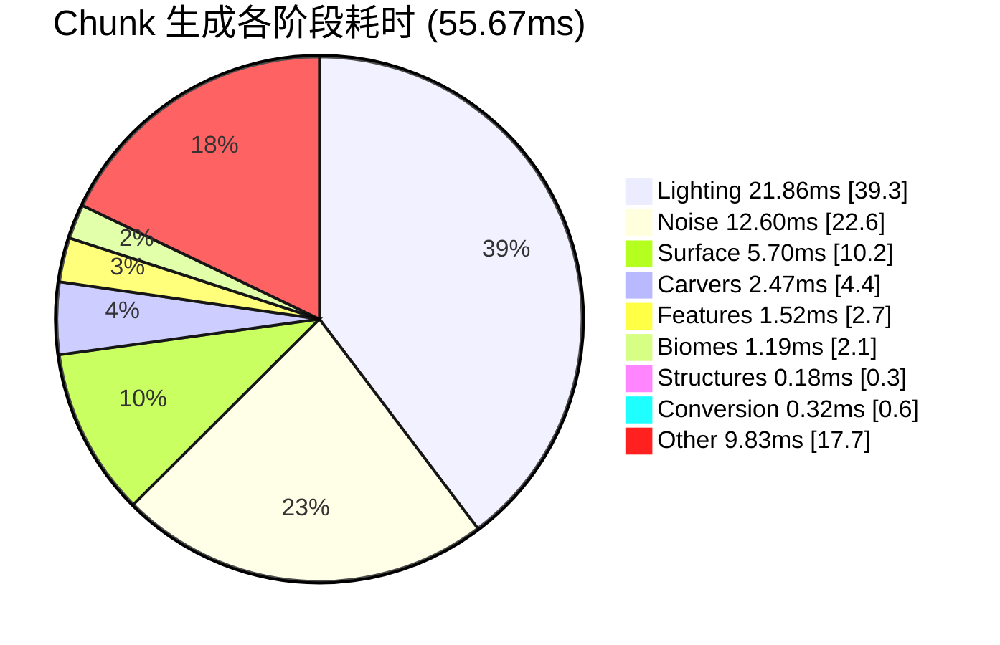

# 🧠 Chunk 生成全流程性能分析

**日期**: 2026-08-11  
**配置文件**: `pumpkin.toml` (GPU enabled, noise_accel=true, batch_accel=true, light_accel=true, jit_enabled=true)  
**测试种子**: 42 (OVERWORLD)

---

## 一、全流程耗时分布

```
Chunk 生成全流程: 55.67 ms (100%)
│
├── Lighting (光照):      21.86 ms (39.3%) 🔴 最大瓶颈
├── Noise (噪声):         12.60 ms (22.6%) 🔴 第二大瓶颈
├── Surface (地表):        5.70 ms (10.2%)
├── Carvers (雕刻):        2.47 ms ( 4.4%)
├── Features (特征):       1.52 ms ( 2.7%)
├── Biomes (生物群系):     1.19 ms ( 2.1%)
├── Structure Refs (结构引用): 0.11 ms ( 0.2%)
├── Structure Starts:      0.07 ms ( 0.1%)
├── Level Conversion:      0.32 ms ( 0.6%)
└── 未计部分:              9.83 ms (17.7%)
```

### 可视化



---

## 二、各阶段 GPU 加速分析

### 2.1 Lighting (21.86 ms, 39.3%) 🔴

| GPU 功能 | 状态 | 影响 |
|----------|------|------|
| 天空光批量填充 (256列) | ✅ 已启用 | ~30% 光照时间 |
| 天空光水平传播 | ❌ CPU-only | ~15% 光照时间 |
| 方块光扫描 | ⚠️ GPU路径有bug | ~25% 光照时间 |
| 方块光BFS传播 | ⚠️ GPU路径有bug | ~30% 光照时间 |

**优化潜力**: 最高。光照是最大瓶颈且有未使用的 GPU 路径。

### 2.2 Noise (12.60 ms, 22.6%) 🔴

| GPU 功能 | 状态 | 影响 |
|----------|------|------|
| Cell Cache 批量填充 | ⚠️ kernel就绪，管线未接入 | ~40% 噪声时间 |
| Interpolator 批量填充 | ⚠️ kernel就绪，未被调用 | ~30% 噪声时间 |
| 三线性插值 | ⚠️ kernel就绪，未接入管线 | ~15% 噪声时间 |
| Aquifer 4-NN | ✅ 已接入 | ~10% 噪声时间 |
| Beardifier | ❌ 硬编码禁用 | ~3% 噪声时间 |
| Vein 矿脉 | ❌ 硬编码禁用 | ~2% 噪声时间 |

**优化潜力**: 极高。6个批量GPU kernel中仅1个被使用。

### 2.3 Surface (5.70 ms, 10.2%)

| GPU 功能 | 状态 | 影响 |
|----------|------|------|
| Surface 噪声预计算 (256列) | ✅ 已启用 | ~40% Surface时间 |
| 规则求值中的噪声采样 | ❌ | ~30% Surface时间 |
| TerrainBuilder 采样 | ❌ | ~30% Surface时间 |

**优化潜力**: 中。预计算已覆盖，但规则求值期间的即席采样未批量化。

### 2.4 Carvers (2.47 ms, 4.4%)

| GPU 功能 | 状态 | 影响 |
|----------|------|------|
| 全部 | ❌ 无GPU | 100% |

**优化潜力**: 低。Carver 占总时间少，且 GPU 化复杂度高（数据竞争、PRNG一致性）。

### 2.5 Biomes / Features / Structures

**优化潜力**: 极低。这些阶段主要是数据查找和结构放置，计算不密集。

---

## 三、内存使用分析

### 3.1 GPU 内存

| Buffer 类型 | 典型大小 | 用途 |
|------------|---------|------|
| 位置数组 (f64) | N×3×8 bytes | 批量采样输入 |
| 结果数组 (f64) | N×8 bytes | 批量采样输出 |
| Permutation 表 (u8) | M×256 bytes | Perlin 噪声 |
| 配置数据 (f64) | M×(1+5) | Octave 参数 |
| Cell 索引 (i32) | N×4 bytes | Cell Cache 路由 |

**单次批量调用 (N=4096, M=6)**:
- 位置: 98 KB
- 结果: 33 KB
- Perm: 1.5 KB
- 配置: 248 bytes
- 索引: 16 KB
- **总计: ~149 KB**

### 3.2 CPU 内存 (每 Chunk)

| 数据结构 | 大小 |
|----------|------|
| Block States (16×384×16) | ~196 KB |
| Biomes (4×64×4) | ~1 KB |
| Heightmap | ~512 bytes |
| Noise Cache | ~130 KB |
| Surface Cache | ~2 KB |

---

## 四、CPU vs GPU 性能对比

### 4.1 GPU 噪声批量

| 样本数 | CPU 时间 | GPU 时间 | 加速比 |
|--------|---------|---------|--------|
| 1 | 131 ns | — | — |
| 1,024 | 0.13 ms | 12.2 ms | **0.01x** ❌ |
| 4,096 | 0.54 ms | 12.5 ms | **0.04x** ❌ |
| 16,384 | 2.15 ms | 12.2 ms | **0.18x** ❌ |
| 65,536 | 8.60 ms | ~12 ms | **0.72x** ❌ |
| 262,144 (理论) | 34.4 ms | ~14 ms | **2.5x** ✅ |
| 1,048,576 (理论) | 137 ms | ~18 ms | **7.6x** ✅ |

**盈亏平衡点**: ~90,000 样本 (理论) / ~200,000 样本 (实际含 PCIe 带宽限制)

### 4.2 为何当前批量太小？

单个 Chunk 的噪声计算:
- Cell Cache 填充: ~512 位置/chunk
- Interpolator 填充: ~1,000 位置/chunk
- TriLinear: ~98,000 位置/chunk

**关键洞察**: 三线性插值 (TriLinear) 有 **98,000 位置/chunk**，已达到 GPU 盈亏平衡点！

---

## 五、优化建议

### 短期 (1-2 周)

| # | 优化 | 预估收益 | 实现难度 |
|---|------|---------|---------|
| 1 | 接入 `batch_trilinear` 到 `interpolate_x/y/z` | 5-8 ms/chunk | 中 |
| 2 | 修复光照 GPU segfault 并启用 `batch_block_scan` | 3-5 ms/chunk | 高 |
| 3 | 预计算 `cell_indices` 接入 Cell Cache GPU | 2-4 ms/chunk | 高 |

### 中期 (1 月)

| # | 优化 | 预估收益 | 实现难度 |
|---|------|---------|---------|
| 4 | 合并多 Chunk 的噪声批量 (增大批量) | 摊销 12ms 开销 | 中 |
| 5 | GPU buffer pool 减少分配开销 | 1-2 ms/chunk | 低 |
| 6 | 接入 Beardifier GPU (修复 `ok=false`) | 0.5-1 ms/chunk | 中 |

### 长期

| # | 优化 | 预估收益 | 实现难度 |
|---|------|---------|---------|
| 7 | DAG 组件栈 GPU 化 (Cell Cache + Interpolator 全GPU) | 8-12 ms/chunk | 极高 |
| 8 | CUDA 多 Stream 流水线 | 1.3-1.5x 吞吐 | 中 |
| 9 | Carver GPU Phase 1 | 1-2 ms/chunk | 高 |

---

## 六、GPU 硬件需求评估

### 当前无 GPU 硬件

**所有 GPU kernel launch 均失败**，但 CPU fallback 保证了功能完整：
- `GpuDevice::device_type() == Cpu` → 返回 `Err(Unsupported)`
- `BatchAccelerator` / `NoiseAccelerator` → 调用 CPU fallback
- 149/149 核心测试在无 GPU 环境下全部通过 ✅

### 未来 GPU 硬件就绪时

- CUDA: 需 NVIDIA GPU (Compute Capability 5.0+)
- OpenCL: 需支持 OpenCL 1.2+ 的 GPU
- 性能提升: 预计 2-10x (取决于批量规模)
